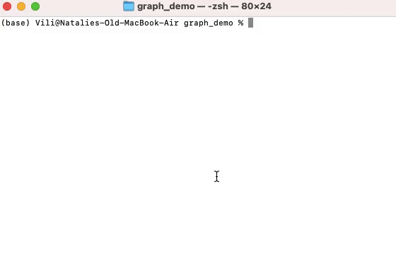

# Graph Demo
> This CLI tool allows the user to create a graph, either from keyboard input or a text file, and run some graph-processing algorithms on it.


## General Information
Building a complex graph for real applications can be complicated and tedious. This tool provides an easy to use interface that allows the user to enter a description of the graph's vertices and edges, and the label of a starting vertex for certain tests. Menu options make it easy for the user to perform several tasks, including:
- Inputting a graph from the keyboard
- Inputting a graph from a flat file
- Viewing the graph
- Finding the minimum spanning tree from the start vertex
- Determining the single-source shortest paths
- Performing a topological sort

The program consists of two main classes: **GraphDemoView** and **GraphDemoModel**. The view class handles interaction with the user, and the model class builds the graph and runs the graph algorithms on it. These algorithms are defined as functions in a separate module named **algorithms**.


## Features
Algorithms available for testing:
- Single-source shortest paths
- Minimum spanning tree
- Topological sort


## Screenshots



## Setup
To run this project:
- Make sure Python 3.9 is installed
- Clone this repository


## Usage
From your command line:
```
# Go into the repository
$ cd graph_demo

# Run the program
$ python3 view.py
```

An example test file, **my_graph.txt**, has been including for testing and for demonstrating the structure of the input file. Line 1 is a list of edges in the format **source>destination:weight** separated by a space. Line 2 is the label of the starting vertex you would like to test. 


## Tasks
To do:
- Unit testing


## Acknowledgements
- This project was inspired by Kenneth Lambert's "Fundamentals of Python Data Structures"